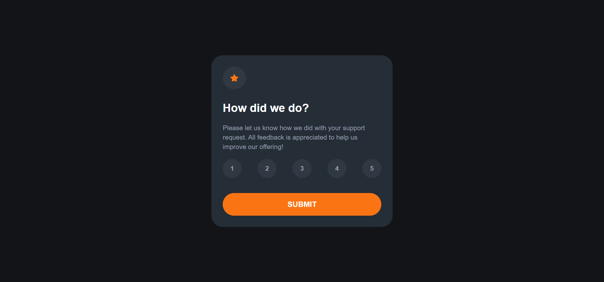
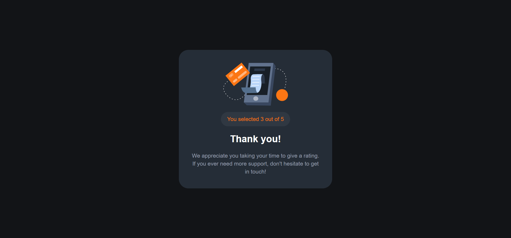

# Frontend Mentor - Interactive rating component solution

This is a solution to the [Interactive rating component challenge on Frontend Mentor](https://www.frontendmentor.io/challenges/interactive-rating-component-koxpeBUmI). Frontend Mentor challenges help you improve your coding skills by building realistic projects. 

## Table of contents

- [Overview](#overview)
  - [The challenge](#the-challenge)
  - [Screenshot](#screenshot)
  - [Links](#links)
- [My process](#my-process)
  - [Built with](#built-with)
  - [What I learned](#what-i-learned)
  - [Continued development](#continued-development)
  - [Useful resources](#useful-resources)
- [Author](#author)
- [Acknowledgments](#acknowledgments)


## Overview

### The challenge

Users should be able to:

- View the optimal layout for the app depending on their device's screen size
- See hover states for all interactive elements on the page
- Select and submit a number rating
- See the "Thank you" card state after submitting a rating

### Screenshot





### Links

- Solution URL: [Github Repo](https://github.com/stephany247/interactive-rating-component)
- Live Site URL: [Live Demo](https://interactive-rating-component-snowy-theta.vercel.app/)

## My process

### Built with

- Semantic HTML5 markup
- CSS custom properties
- Flexbox
- CSS Grid
- Mobile-first workflow
- [React](https://reactjs.org/) - JS library
- [Tailwind CSS](https://tailwindcss.com/docs/installation) - For styles


### What I learned

While working on this project, I gained a deeper understanding of managing component states in React, particularly using useState to handle user interactions dynamically.

I also improved my knowledge of TypeScript by explicitly defining state types, which helped prevent potential runtime errors.

Here's a snippet of how I managed the button state:

```js
const [rating, setRating] = useState<number | null>(null);
const [submitted, setSubmitted] = useState(false);

const handleSubmit = () => {
  if (rating !== null) {
    setSubmitted(true);
  }
};

```

### Continued development

Going forward, I want to focus on:

- TypeScript Best Practices – While I implemented TypeScript in this project, I aim to deepen my understanding of type safety and interface design.
- State Management – Exploring more complex state management solutions like Zustand or Redux for handling application logic in larger projects.

### Useful resources

-[W3Schools TypeScript Tutorial](https://www.w3schools.com/typescript/index.php) - Helped me understand TypeScript basics and how to apply them in my project.
-[MDN Web Docs](https://developer.mozilla.org/en-US/) - A great reference for understanding HTML, CSS, and JavaScript concepts, which helped clarify some accessibility best practices.
-[Tailwind CSS Documentation](https://tailwindcss.com/docs) - Provided guidance on utility classes and responsive design techniques, making styling much more efficient.


## Author

- Website - [Onyinye Stephanie Oguocha](https://www.your-site.com)
- Frontend Mentor - [stephany247](https://www.frontendmentor.io/profile/stephany247)
- Twitter - [@stephanyoguocha](https://x.com/stephanyoguocha)

## Acknowledgments

I would like to thank the following resources and individuals for their support and inspiration:

- [Frontend Mentor](https://www.frontendmentor.io) - For providing the project challenge.
- [React](https://reactjs.org) - For the amazing library.
- [Tailwind CSS](https://tailwindcss.com) - For the utility-first CSS framework.